# Chapter2 构建决策树

## 2.1 分治策略(Divide and conquer) 构建初始树

输入集合:

分类集合：

有三种可能：

- T集合中所有实例都属于一个类别，那么T构成的决策树是一个叶子，标识为类

- T集合中没有实例，那么T仍构成叶子节点，但是这个叶子的类别与其他信息有关。例如：C4.5中是把父节点中最常见的类作为这个叶子节点的类

- T集合中多类混合：需要把T分成多类，即多个子集。根据单一属性进行test将T进行分类

举例说明：

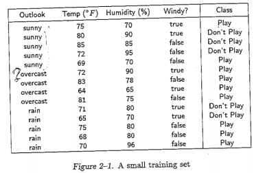 

如图所示：输入集合共有四个属性，两个类。→属于以上所说的第三种情况，所以需要把T划分为多个子集

我们可能选择这四个属性进行测试：

如果首先选择outlook单一属性进行分类，有三种输出 sunny, overcast, rain。但是可以发现当outlook=sunny时，最终输出的class既有Play也有Don’t play，即仅根据outlook进行分类是不够的，所以需要进一步选择其他属性进行test，得出以下步骤：

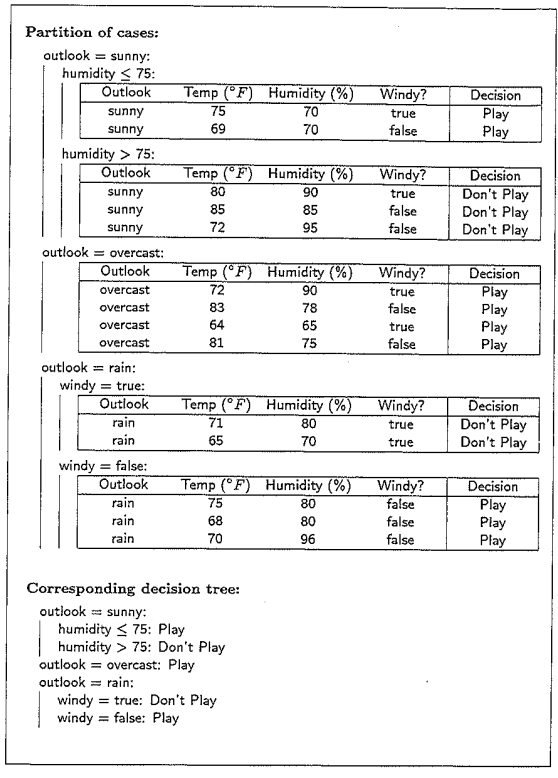

## 2.2 评价tests

目的：选择合适的tests。因为构建树的目的不仅仅时发现这样的分类，而是去揭示树真正的结构以使其有预测的能力。我们需要每个叶子节点有尽可能多的实例，即分类有尽可能少的块(blocks)。

这句话我理解为例如：humidity以75为界分为两块，而80，70，90都可以作为分割的界限，但是要使块数尽可能的少，因此需要优化。

为什么不尝试构建所有的树进行比较？因为上图这个实例我们可以构建棵树。

贪婪算法（greedy algorithm）：在每一步选择中都采取在当前状态下最好或最优（即最有利）的选择，从而希望导致结果是最好或最优的算法。大多数决策树都是采用贪婪算法。

### 2.2.1 增益准则(gain criterion)

**符号说明**：

实例的集合，表示集合S中属于类的个数

ID3中使用的标准叫做增益(gain),增益的思想是：数据中表达的信息取决于它的概率，可以用比特表示为负的以2为底的概率的对数。例如：有8个概率相同的消息，那么每个消息表达的信息量为 bits

所以从集合S中选择一个类别为的实例，它所表达的信息量为：

为了从各类中获取期望信息，我们进行求和

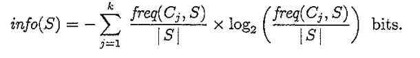 

当应用于训练集时，info(T)度量的是将T进行分类所需要的信息量。(这也称之为集合S的熵entropy)

对测试集分类后的期望信息进行类似的计算：、

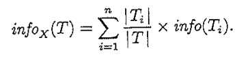 

增益(gain)描述根据训练集T得到的分类规则应用于测试集X时，得到的信息差距。

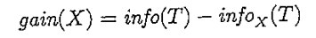 

增益准则的目的就是选择一个test是的增益(gain)最大化。（也叫做测试集X和分类的互信息mutual information）

现在来计算刚才实例的信息量：

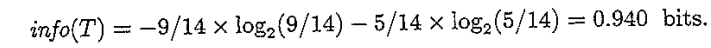 

使用outlook属性把T分割为三个子集后的信息量：

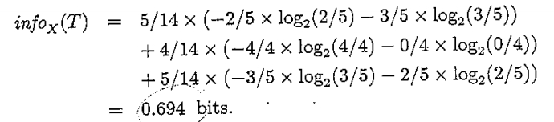 

这里的增益为：0.940-0.694=0.246

现在考虑，不用outlook属性字段，我们也可以考虑先使用windy进行分类，这会被分为两个子集：

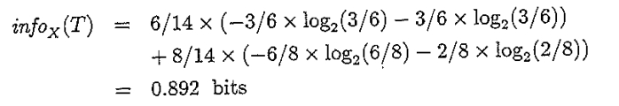 

这里的增益为：0.048 少于之前的增益

所以增益准则会优先选择outlook而不是windy

### 2.2.2 增益比准则(gain ratio criterion)

增益准则(Gain criterion)的缺陷：它偏向于有许多输出结果的测试集(it has a strong bias in favor of tests with many outcomes)。

举一个极限的例子：如果一个测试集合中每个元素都分别代表一类，那么这个测试机的信息量就会计算为，所以这里得到的信息增益就会达到最大。对于预测来说，这种分类是没有意义的。

这种偏差可以通过一种标准化进行纠正：考虑实例的信息量不取决于训练集中的类别，而是取决于测试集输出的类别结果。这表示了把T分类为n个子集所创造的的潜在信息

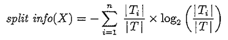 

而增益(gain)度量由相同分类所产生的信息。然后用以下式子计算分类的价值：

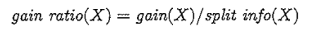 

根据前面举出的例子，根据outlook进行分类产生的split information:

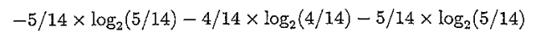 

## 2.3 tests

一些分类系统定义了一些可能的tests,然后尝试所有的这些tests。一个test只针对于单一属性。

C4.5 包含三种类型的tests:

- 对离散属性的”standard” test,对属性的每一个可能的值都有一个结果
- 对离散属性的值进行分组，每个分组对应一个输出
- 如果属性是连续数值，设定阈值对属性进行离散化

对于任何一种分类，都要保证至少有两个子集且包含了一定数量的实例